# Cloud ML Ecosystem (CMLE)

This repository documents the various steps and pipelines needed to run Machine Learning (ML) models leveraging Adobe Experience Platform data. There are 2 parts to this repository:
- Notebooks to illustrate the end-to-end workflow on a variety of cloud ML platforms.
- Pipeline and library code that can be extended from to add your own ML model and data.

## Contents
The git repo currently contains five notebooks showcasing the full lifecycle of an ML application leveraging the Adobe Experience Platform.

Notebook Link | Environment | Summary | Scope
------------- |-------|---------| -----
[Week1Notebook.ipynb](notebooks/assignments/Week1Notebook.ipynb) | Local | Data Exploration | Create synthetic data and perform exploratory data analysis.
[Week2Notebook.ipynb](notebooks/assignments/Week2Notebook.ipynb) | Local | Featurization | Generate a training set and export to cloud storage.
[Week3Notebook.ipynb](notebooks/assignments/Week3Notebook.ipynb) | Cloud Platform | Training | Plugging in features into a machine learning model.
[Week4Notebook.ipynb](notebooks/assignments/Week4Notebook.ipynb) | Cloud Platform | Scoring | Generating propensity scores for all profiles and importing back to the Experience Platform.
[Week5Notebook.ipynb](notebooks/assignments/Week5Notebook.ipynb) | Cloud Platform | Targeting | Target profiles based on propensity interval.

Before you can use any of the code in this repository, there is some setup required.
Please refer to the `Environment` part of the table above to determine the setup needed to run that notebook as described in the next section.

**Note**: If the `Environment` says `Cloud Platform` you can use your Cloud Platform of choice to run this notebook and refer to the appropriate section of the setup below.

## Configuration File

There is a common [configuration file](./conf/config.ini) used by all the notebooks.
For the setup you can refer to the following section, but here are the different configuration options you should use:

Config Property | Section | Description                                                | Value | Needed for
----------------|---------|------------------------------------------------------------|-------|------------
ims_org_id | Platform | The organization ID                                        | See section below on **Org-level Information** | Weeks 1 through 5
sandbox_name | Platform | The ID of the sandbox to use                               | See section below on **Org-level Information** | Weeks 1 through 5
dataset_id | Platform | The ID of the dataset containing the synthetic data        | Dataset ID created as part of [Week1Notebook.ipynb](notebooks/assignments/Week1Notebook.ipynb) | Week 2
featurized_dataset_id | Platform | The ID of the dataset containing the featurized data       | Dataset ID created as part of [Week2Notebook.ipynb](notebooks/assignments/Week2Notebook.ipynb) | Weeks 3 & 4
scoring_dataset_id | Platform | The ID of the dataset containing the scoring output        | Dataset ID created as part of [Week4Notebook.ipynb](notebooks/assignments/Week4Notebook.ipynb) | Week 5
environment | Platform | The type of environment this organization is running under | **prod** if running in production, **stage** otherwise | Weeks 1 through 5
client_id | Authentication | The client ID used for API calls                           | See section below on **Authentication Information** | Weeks 1 through 5
client_secret | Authentication | The client secret used for API calls                       | See section below on **Authentication Information** | Weeks 1 through 5
private_key_path | Authentication | The path to the private key for your JWT token             | See section below on **Authentication Information** | Weeks 1 through 5
tech_acct_id | Authentication | The technical account ID used for API calls | See section below on **Authentication Information** | Weeks 1 through 5
export_path | Cloud | The path in your Cloud Storage account where featurized data will be exported | Default to `cmle/egress` | Weeks 2, 3 & 4
import_path | Cloud | The path in your Cloud Storage account where scoring results will be written | Default to `cmle/ingress` | Weeks 4 & 5
data_format | Cloud | The format of the files for the featurized data | Default to `parquet` | Weeks 2, 3 & 4
compression_type | Cloud | The type of compression for the featurized data | Default to `gzip` | Weeks 2, 3 & 4
model_name | Cloud | The name of the model | Default to `cmle_propensity_model` | Weeks 3 & 4

We assume familiarity with the [connectivity to Adobe Experience Platform APIs](https://experienceleague.adobe.com/docs/experience-platform/landing/platform-apis/api-guide.html?lang=en), but for brevity the key setup points are listed below.

### Org-level Information

To connect programmatically to your Adobe Experience Platform instance, we need to know a couple pieces of information:
- The **IMS organization ID**: this represents your entire organization and is the same across all your sandboxes.
- The **sandbox name**: You may have multiple sandboxes for different environments or business units. The default one is `prod`

You may already have this information, in which case you can skip to the next section. If you do not, you can log into your Adobe Experience Platform instance and press `CTRL + i` (even on Mac) to bring up the data debugger as shown below which contains your organization ID.

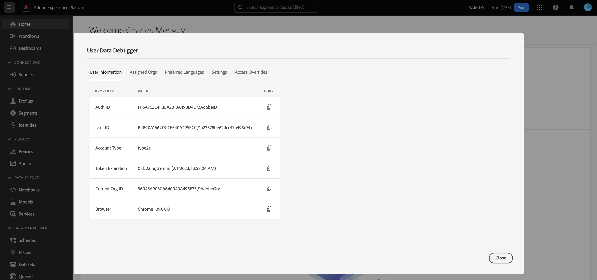

For the sandbox name, you can get it one of 2 ways:
- If you do not have admin access to your Adobe Experience Platform instance, you can find it in the url within the section starts with sname.In the example below, the sandbox name is `cmle`. Be aware though it should be all lowercase and not contain any spaces so if you are unsure you can ask your instance admin to verify.
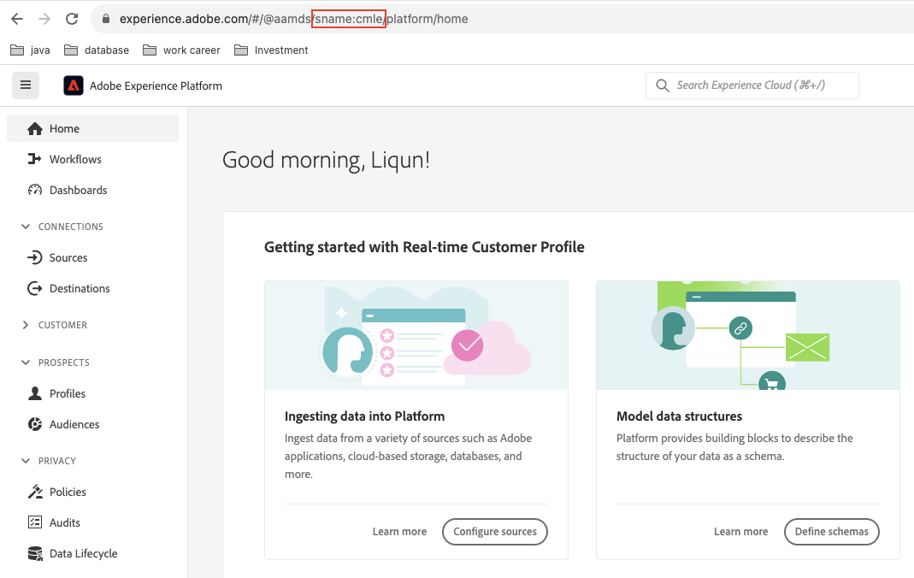
- If you have admin access, you can navigate to the `Sandboxes` panel to the left, click on `Browse` and note the **name** value of the instance you want to use.

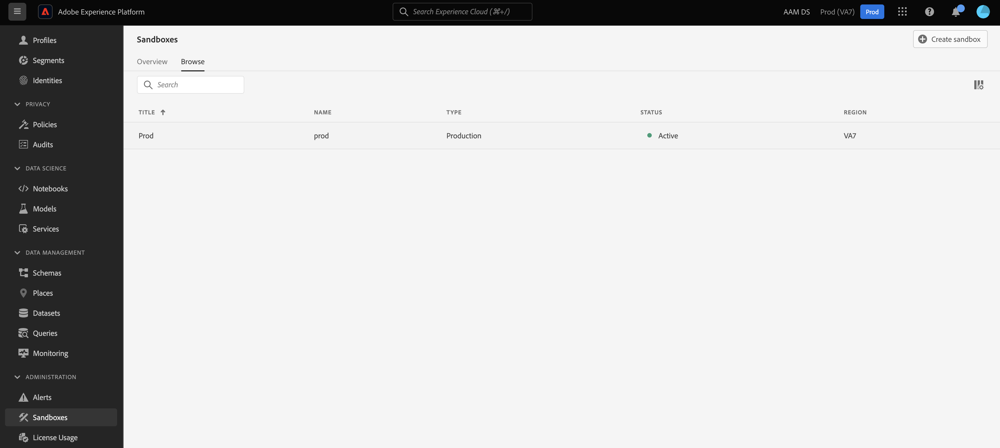

### Authentication Information

Authentication with the Adobe Experience Platform can be performed using JSON Web Tokens (JWT) and will allow you to interact with most Adobe Experience Platform APIs and handle automated processes such as:
- Creating schemas and/or datasets
- Ingesting data
- Querying data
- ...

The process to setup a JWT connection is described below, and you will need to capture a few fields that will be used throughout the notebooks and configurations in this repository.

The first step is to go to the [Adobe Developer Console](https://console.adobe.io/) which comes with any Adobe Experience Platform organization. Make sure you are logged into the organization you would like to use. You should be presented with a screen like below:

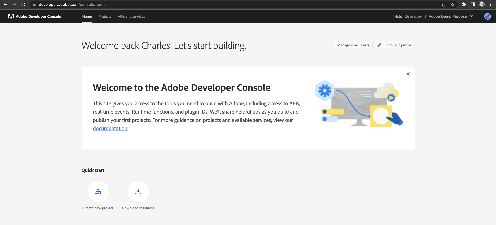

Once on that page, there are 2 options:
- You already have an existing developer project setup. If so, just click on that project that should appear here.
- You haven't used the developer console yet or do not yet have a developer project setup. If so, just click on `Create new project` which will create it immediately and take you to its home page.

Once on the project page, several options are presented to you as shown below. Click on `Add API`.

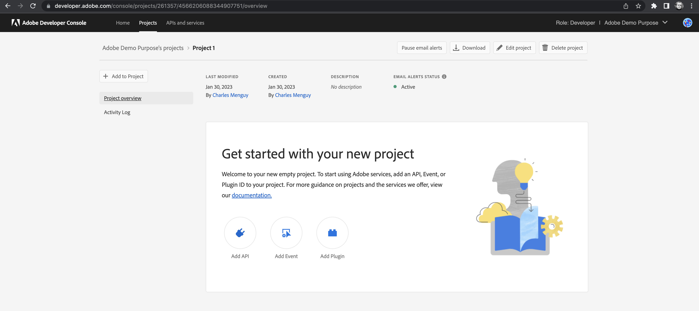

In this new API page, you will be shown the different types of APIs that are available. In our case, we want to create an `Experience Platform API`. Select that option and press `Next`.

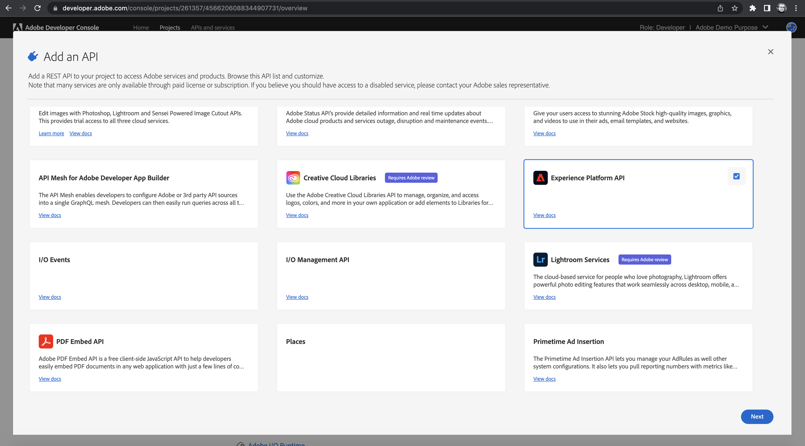

This next page allows you to configure access to your API. There's a couple options related to your choice of [SSH key pair](https://www.ssh.com/academy/ssh/public-key-authentication):
- If you do not have a key pair yet or would like to use a brand new one, you can select the first option to generate one on the fly.
- If you already have a key pair generated, you are able to upload it here and reuse it by selecting the second option.

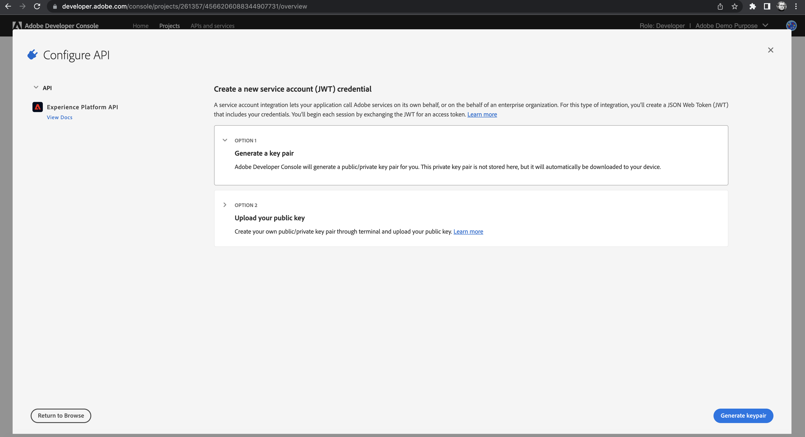

For the purposes of this setup we recommend creating a new keypair with the first option. Clicking on `Next` will prompt you to download a `zip` file containing your public and private key, so make sure to accept and store it securely on your file system.

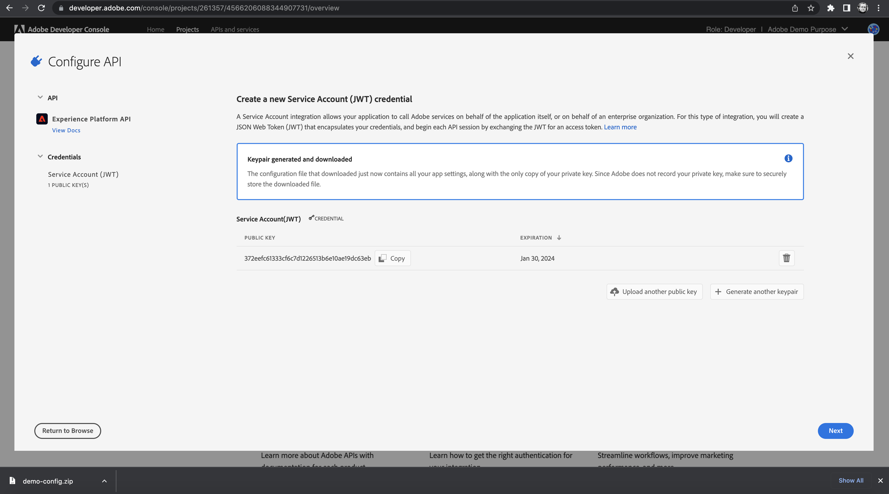

For example here we called our `zip` file `demo-config.zip`. Once download is complete, go into your terminal and extract the private key and certificate into a directory by using the following command:

```
$ unzip demo-config.zip -d demo-config
Archive:  demo-config.zip
 extracting: demo-config/certificate_pub.crt
 extracting: demo-config/private.key
```

This file `private.key` is what you will need later on so make sure to remember where it is located.

Make sure to note down the public key displayed on this screen as well, then click `Next`. This next page will ask you to select a product profile. It will depend what profiles are configured on your org - they are used to scope access to only what is necessary. You can work with your organization administrator to find out the right profile, and then select it as shown in the screen below.

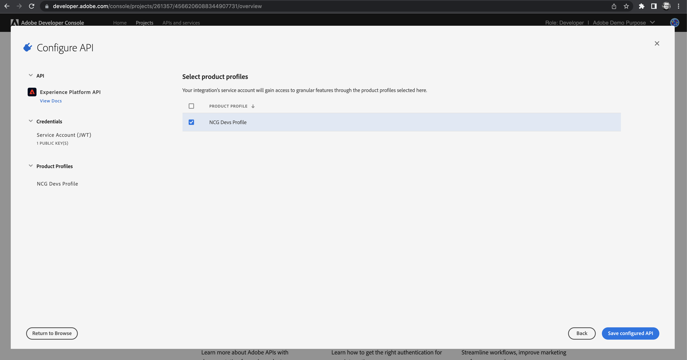

Make sure your api credential is assigned with Role(s) that contains all necessary permissions from Adobe Experience Platform UI under the tab Administration -> Permissions -> Roles -> API credentials. Please provide your credential info with your org administrator if you can't see the tab yourself.
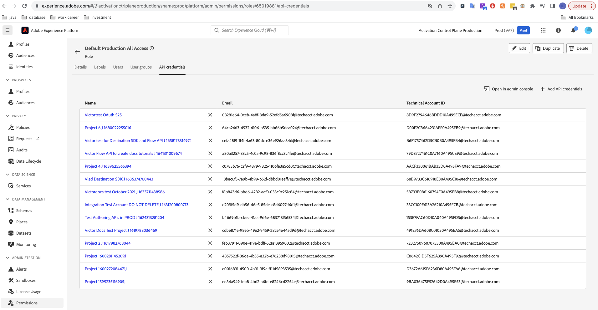


Now your setup is complete, and you will be taken to the summary page for your API connection. You can verify that everything looks correct and scroll down to see a few fields:

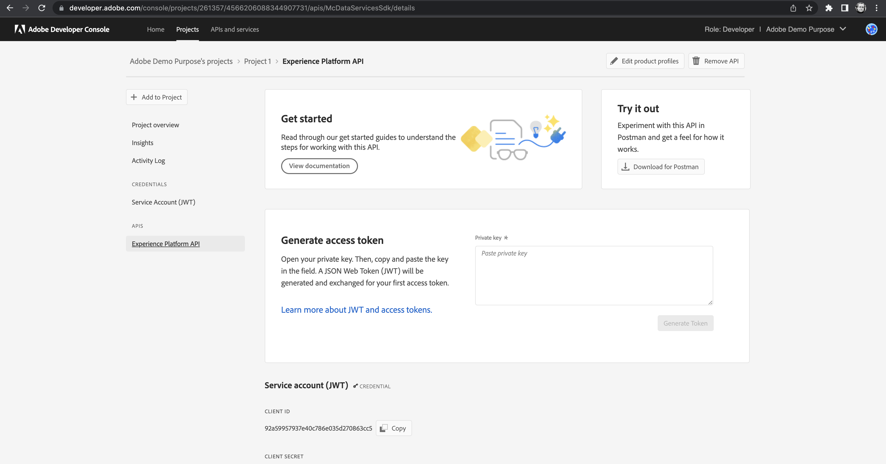
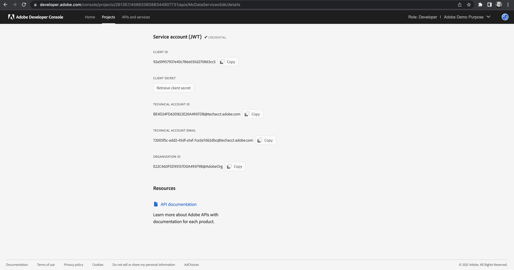

The main fields you'll want to note down for further reference in this repository are:
- **Client ID**: This is used to identify yourself when you use programmatic API access.
- **Client secret**: Click on `Retrieve client secret` to see the value and **do not share it with anyone**
- **Technical account ID**

In addition to those, you'll want to save your private key.
Make sure to save it in a secure location on your disk as it will need to be pointed to in your configuration file.

## Setup

### 1. Local setup

Make sure to set the environment variable `ADOBE_HOME` to the root of this repository. This can be accomplished with the following command for example:

```
$ export ADOBE_HOME=`pwd`
```

For simplicity you can set it in your `.bashrc` or `.zshrc` (or the corresponding profile file if you use a different shell) to ensure it gets loaded automatically.

After setting up the configuration file described above, you can start your Jupyter notebook server **at the root of this repository**.
Please select python kernel 3.0 or above
It is important to start it at the root because the notebooks look for images on parent folders, so images will not render properly if you start the server too deep.

### 2. Databricks setup

Here are the pre-requisites to run these notebooks on Databricks:
- Databricks Runtime Version should be of type **ML** and not Standard.
- Databricks Runtime Version should be above `12.1 ML`
- Your compute environment can be any number of nodes on any instance type.
- You will need to create a personal user token
- You will need to define $DBUSER to be your user on the databricks cluster
- To begin please setup a personal access token on your databricks cluster by following these instructions [Access_Token Setup](https://docs.databricks.com/dev-tools/auth.html)
The next few steps assume you have already installed and setup the [Databricks CLI](https://docs.databricks.com/dev-tools/cli/index.html) to point to your Databricks workspace.
- Copy the private key file you obtained following the configuration file setup to your Databrick workspace filesystem using:

```
$ databricks fs cp /path/to/private.key dbfs:/FileStore/shared_uploads/$DBUSER/cmle/keypairs/private.key
```
- Update the [configuration file](./conf/config.ini) to point the field `private_key_path` to the destination path, for example `private_key_path=/dbfs/FileStore/shared_uploads/$DBUSER/cmle/keypairs/private.key`
- Copy the updated configuration file to your Databricks workspace filesystem using:

```
$ databricks fs cp conf/config.ini dbfs:/FileStore/shared_uploads/$DBUSER/cmle/conf/config.ini
```

- Import the notebooks in your workspace. Please refer to the `Contents` section of this README to determine which notebooks should run on Databricks.
For example to import the week 3 notebook you can do:

```
$ databricks workspace mkdirs /Users/$DBUSER/cmle
$ databricks workspace import notebooks/assignments/Week3Notebook.ipynb /Users/$DBUSER/cmle/Week3Notebook -l python -f jupyter
```

- Create a compute environment following the pre-requisites mentioned above, and make sure to include in the `Environment variables` section the following:

```
ADOBE_HOME=/dbfs/FileStore/shared_uploads/$DBUSER/cmle
```

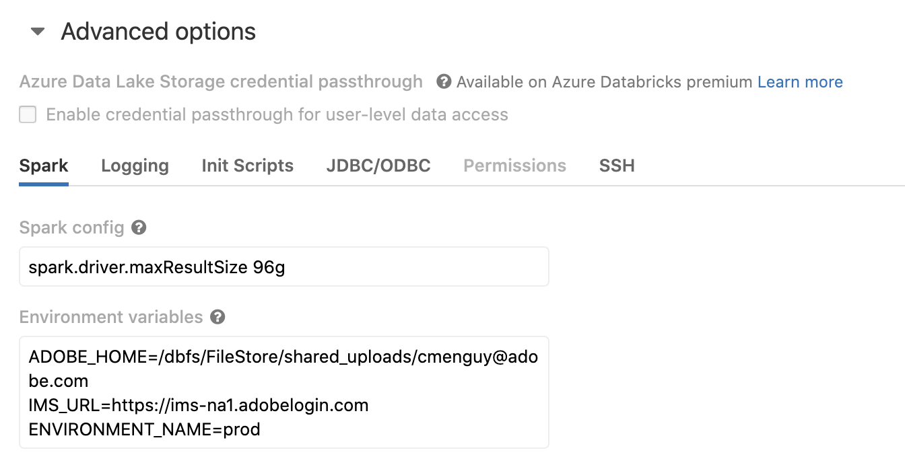

- After the compute environment is started successfully, attach the imported notebook to it. You are now ready to execute it.

### 3. Azure ML setup

Not yet supported.

### 4. SageMaker setup

5 custom notebooks have been built that show Sagemaker support. 
Once you have completed the steps above including Configuration File, Org-level Information and Authentication Information. 
Please find the customized notebooks in notebooks/aws_sagemaker and follow the SageMaker specific [README](notebooks/aws_sagemaker/README.md)

#### 4.1 Sagemaker studio environment requirements
- A custom jars subdirectory with the image below delineating the jars needed to be installed
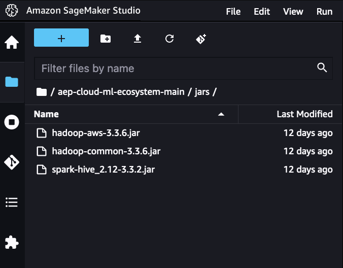
- A conf directory with a config.ini with the appropriate parameters for all of the authentication and the featurized dataset id
- The file private.key needs to be uploaded to the root directory of the sagemaker studio environment

### 5. DataRobot setup

The DataRobot implementation allows you to leverage the DataRobot Development and MLOps capabilities to train models, deplopy them and write predictions into the AEP environment.
A demo of the workflow can be found here: https://www.dropbox.com/scl/fi/apdzy8eoizrhm64n006hz/DR-DEMO.mp4?rlkey=bqf5vtx9n3m1cv6hebnwxe1uk&dl=0
To config add the DataRobot token and API-endpoint fields under the DataRobot section. If you have not created one, please refer to the following guide: https://docs.datarobot.com/en/docs/api/api-quickstart/index.html#create-a-datarobot-api-key
For any questions, please reach out to support@datarobot.com
