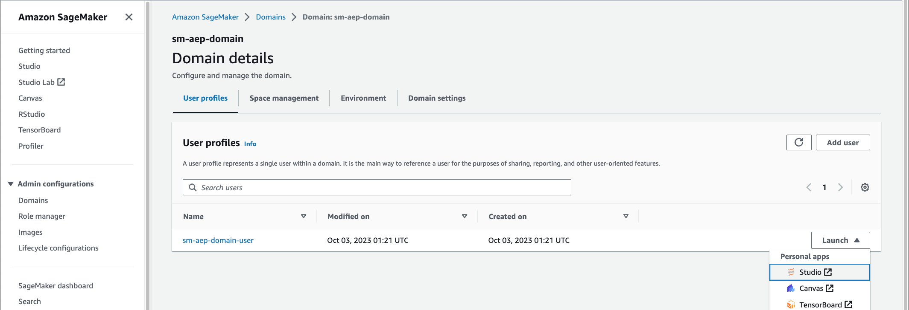

# AWS README


## End to end ML demo: Adobe Experience Platform (AEP) / Amazon S3 / Amazon SageMaker Studio

This README walks through the setup of Amazon Web Services (AWS) resources that are needed to execute the notebooks from Adobe’s Cloud ML Ecosystem (CMLE) GitHub repo. The five notebooks demonstrate how to query and create a dataset from AEP data sources to be used for machine learning; transfer that data using the AEP data flow service to an S3 destination; train the ML model using a SageMaker Studio notebook; and finally create customer segments derived from model predictions that are delivered back to AEP using the data flow service. 

Amazon S3 is an object storage service that will serve as a target and source for the AEP data flow service to move data (e.g. featurized data, predictions) to and from. S3 is a foundational storage service integrated with many AWS services such as Amazon SageMaker. See [Amazon S3](https://aws.amazon.com/s3/) for more information.

Amazon SageMaker is a fully managed service to prepare data and build, train, and deploy machine learning (ML) models for any use case with fully managed infrastructure, tools, and workflows. CMLE notebooks will be run from SageMaker Studio notebooks. Future releases will incorporate more SageMaker features such as training, inference, model registry, and more. See [Amazon SageMaker](https://aws.amazon.com/sagemaker/) for more information.

Resources are deployed using the AWS Cloud Development Kit (AWS CDK), a toolkit (CDK CLI) and set of libraries that define and deploy AWS resources using standard programming languages like Python and Javascript. AWS CDK code synthesizes to AWS CloudFormation templates and deploys stacks using CloudFormation. See [AWS CDK](https://aws.amazon.com/cdk/) for more information.

### Pre-requisites

* [AWS account](https://docs.aws.amazon.com/accounts/latest/reference/manage-acct-creating.html) 
* IAM role or user with admin privileges - used to provision AWS resources; CDK behaves similar to other AWS tools (e.g. SDKs, AWS CLI) when looking for credentials on your local machine (e.g. env variables, credentials file)
* Choose an AWS region (recommended: Oregon/us-west-2)

### Resources

The provided CDK project provisions the following - 

* VPC
  * Public and private subnets (across 2 availability zones)
  * NAT gateway
  * IGW 
  * S3 VPC endpoint
* IAM user - to generate API keys to be used by the AEP data flow service
* IAM policy - grant read/write to the S3 data bucket for the AEP data flow service and SageMaker studio notebook
* SageMaker Studio execution role - assumed by the Studio notebook, and used to execute CMLE notebooks; using IAM auth
* SageMaker Studio domain and user profile
* Security group and rules - 
  * grant NFS access between SageMaker Studio domain and EFS mounts 
  * grant TCP 8192-65535 Jupyter Server application and the Kernel Gateway application
* S3 bucket - data bucket; encryption is enabled by default
* S3 VPC endpoint

Note: The CDK project provisions resources needed to complete the CMLE notebooks. There is a baseline for security and aspects of resiliency built in to the architecture given the selection of services. If you plan to adapt this for production use cases, we recommend deeply reviewing and adapting the CDK code to adhere to your or your company's security standards. For example, adopting corp standards for auth, logging, monitoring, etc.

## Deploy resources using CDK

Perform these steps on your local machine/laptop. 

(**NOTE TO TESTERS: Firstly thanks for helping out! If you run into any broken or incorrect links, please let @andymui know. Thanks!**)

1. Clone the [AEP CMLE repo](https://github.com/Adobe-Marketing-Cloud/aep-cloud-ml-ecosystem/tree/main) to a desired location.

```
git clone git@github.com:Adobe-Marketing-Cloud/aep-cloud-ml-ecosystem.git
```

2. Navigate to `aep-cloud-ml-ecosystem-main/notebooks/aws_sagemaker/infra/` from the root of the repo

```
cd aep-cloud-ml-ecosystem-main/notebooks/aws_sagemaker/infra
```

3. Install CDK Toolkit - this command installs the CLI tool to issue CDK commands

```
npm install -g aws-cdk
```

4. Verify installation

```
cdk --version
```

5. Bootstrap CDK - this sets up necessary resources in your account for CDK to operate; substitute your AWS account number in the command below and change region code, if using a different region.

```
cdk bootstrap aws://REPLACE-WITH-YOUR-AWS-ACCT-NUMBER/us-west-2
```

6. Create virtual environment

```
python3 -m venv .venv
```

7. Activate virtual environment

*if using Mac/Linux -* 

```
source .venv/bin/activate
```

*If using Windows -* 

```
.venv\Scripts\activate.bat
```

8. Install dependencies - AWS CDK libraries used by the CDK script

```
pip install -r requirements.txt
```

9. Configure the CDK environment. 
    
    a. Open `app.py` in a text editor, and update `env` to the desired target region and AWS account to launch resources. The commented code also shows an alternative to use environment variables, if desired. Setting this in code is a nice way to pin the target deployment account and region.


10. Synthesize the stack.

    a. CDK allows AWS resources to be defined using common programming languages. When it’s time to deploy, CDK will synthesize the app code to CloudFormation templates and launch the stacks using CloudFormation. This command generates the templates without deploying and is a good way to confirm dependencies are installed, CDK is configured properly, and the CDK code doesn’t have errors. 

```
cdk synth
```

*Note: To review the synthesized CloudFormation template, navigate to the `cdk.out` folder within the `infra` folder and open `InfraStack.template.json`.*

11. If no errors appear from the synth command, proceed with deployment. This should take about 6-8 min.

```
cdk deploy
```

12. A successful deployment will have an output similar to this - 


13. Note down the Outputs and Stack ARN (aka Stack ID) from the CDK deployment. You will need them during the post deploy steps. 

## Post deploy steps

Once AWS resources have been provisioned, follow these steps using the AWS Management Console to launch a SageMaker Studio notebook, pull down the CMLE notebooks, and start working through the notebooks. A Studio notebook can be used to run all notebooks. 

1. Once CDK finishes deploying, launch a SageMaker Studio session.

    a. **Open** [SageMaker console -> Domains](https://console.aws.amazon.com/sagemaker/home#/studio)
    
    b. **Click** the provisioned domain named `sm-aep-domain` to view domain details
    
    c. **Launch** Studio from the dropdown next to the provisioned user profile `sm-aep-domain-user`



2. Once Studio has loaded in a separate browser tab, open a System terminal using the Launcher

    a. **Click** on the **home icon** () to reveal a navigation panel
    
    b. **Click** on **Home** in the menu
    
    c. **Click** on **Open Launcher**

    d. Under "Utilities and files", **click** on **System terminal**


*Note: things like apps, actions, and utilities will open in a new tab. For notebooks and utils like terminal, closing the tab doesn’t terminate the compute they run on. View and turn off running compute using the **Running Terminals and Kernels** view. Screenshot below is for reference, do not shut down any resources.*


3. Download the Adobe CMLE GitHub repository to SageMaker Studio.

    a. **Clone** the [Adobe CMLE repo](https://github.com/Adobe-Marketing-Cloud/aep-cloud-ml-ecosystem/tree/main) using the terminal

```
git clone git@github.com:Adobe-Marketing-Cloud/aep-cloud-ml-ecosystem.git
``` 

*Note: An alternative to cloning the repo, you can **download** the repo code as a .zip file, **upload** it to Studio, and **unzip** the file. To upload files, **open** the File Browser () and **click** the upload files icon (). To unzip files, install `unzip` from your SageMaker Studio system terminal - `sudo yum install unzip`. Then issue the unzip command - `unzip YOURZIPFILE.zip`.*


4. Refer to the CDK deployment outputs noted earlier, and set the AWS values in the config.ini file which will be used by the notebooks throughout the demo.

    a. Using the File Browser (), **navigate** to `aep-cloud-ml-ecosystem-main/conf`

    b. **Double-click** on `config.ini` to open it in the editor

    c. **Copy** the **S3DataBucket** value from CDK outputs, and **paste** in the **[AWS]** section **→** **s3_bucket_name** property. 

    d. **Set** a S3 prefix for the **s3_prefix** property. (Note: this is a not a value from CDK outputs, so it could simply be "test" if you do not have a specific prefix in mind) 

    *Note: a S3 prefix is a string of characters at the beginning of the object key name. It’s a way to organize data in a bucket. See AWS documentation for more info - See [Organizing objects using prefixes](https://docs.aws.amazon.com/AmazonS3/latest/userguide/using-prefixes.html)*

    e. **Copy** the **Stack ARN** value from CDK outputs, and **paste** in the **[AWS]** section **→ cfn_stack_id** property. **Save** the file.

    f. After the changes, the bottom of your config.ini should look similar to this (Note: the user chose to use “cmle-test” as the prefix in this case) 


(**INTERNAL TESTERS, SKIP THE FOLLOWING STEPS 5 & 6**)

5. Now that the configuration has been set, install script dependencies and run the validation script from the System terminal to check the S3 bucket, S3 prefix, and credentials are working as expected. 

    a. Using the System terminal, **navigate** to `aep-cloud-ml-ecosystem-main/notebooks/aws_sagemaker/utils`

    b. **Install** dependencies - `pip install boto3 rich_argparse` 

    c. **Run** command: `python3 validate.py`

6. If the validation script returns **SUCCESS**, get started with the Week1 notebook.

    a. Using the file explorer, **navigate** to `aep-cloud-ml-ecosystem-main/notebooks/aws_sagemaker`

    b. **Double-click** on **Week1Notebook_sagemaker.ipynb** to open in the editor

    c. When prompted to “Set up notebook environment“, select the following options from the dropdowns - 


*Note: The ML training done in the notebook is not complex, so a general purpose instance should be fine. It’s ok to choose a different instance type, if desired.* 

### Clean-up

When finished running through all CMLE notebooks, follow these steps to tear down provisioned AWS resources.

1. Tear down the CDK stack 
  
    a. **Navigate** to `aep-cloud-ml-ecosystem-main/notebooks/aws_sagemaker/infra` where `cdk.json` lives

    b. **Destroy** the stack

```
cdk destroy
```

