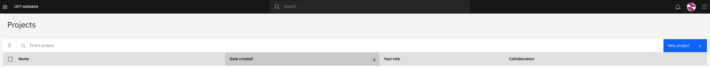
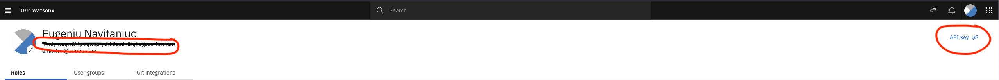
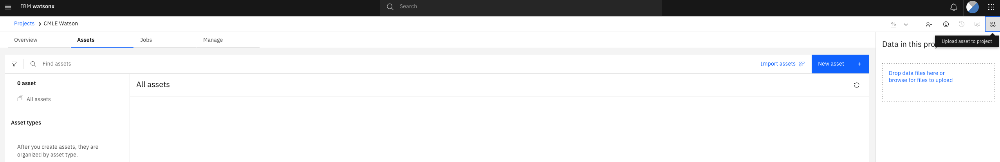
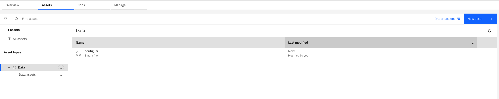
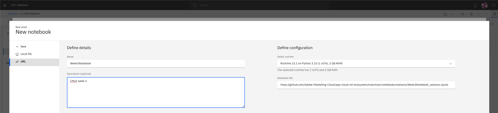

# WATSONX README

## Adobe Experience Platform (AEP) / Watsonx

This README walks through the setup of Watsonx resources that are needed to execute the notebooks from Adobe’s Cloud ML Ecosystem (CMLE) GitHub repo. The first two notebooks demonstrated how to query and create a dataset from AEP data sources to be used for machine learning; transfer that data using the AEP data flow service to DLZ; The following 3 notebooks will showcase how to train the ML model using a Watsonx; and finally create customer segments derived from model predictions that are delivered back to AEP using the data flow service.

Watsonx is an advanced AI and data platform, designed to accommodate the entire AI lifecycle, including building, managing, and deploying AI models. See [Watsonx](https://www.ibm.com/watsonx) for more information.

The steps below assume you have an account on watsonx, if not please ensure you have one. See [Watsonx](https://www.ibm.com/watsonx) for more information.

### Setup

* Navigate to watsonx `Project` tab and create new project  (select `Create and empty Project`) Supply a name and description, save it.

* Next step we need to pull `user_name` and `user_key` to be able to interact with watson programmatically, navigate to `Profile and settings` top right corner, here you have access to `user_name` and `key`  
Additionally we need `instance_id`, `url` and `version` these you could find by [browsing](https://www.ibm.com/docs/en/cloud-paks/cp-data/4.8.x?topic=assets-authenticating-programmatic-access), at the time of writing these notebooks the version was `4.8`  

* Next store these values in [config.ini](../../conf/config.ini) (which you used through notebooks 1 and 2) under `[Watsonx]` section. Do not share them with anyone.

* Next step we will upload our config.ini file (which you used through notebooks 1 and 2), go to `Assets` > `New asset` > `Upload asset to this project`  confirm new `Data` asset type was created: 
 
* We are ready to import notebooks, for that navigate to `Assets` > `New Asset` > `Jupyter Notebook editor` > `URL`, supply `name` choose `Runtime 23.1 on Python 3.10` and provide `path` to notebooks/watsonx/Week*.ipnynb notebooks from CMLE git repo.

We are all set.